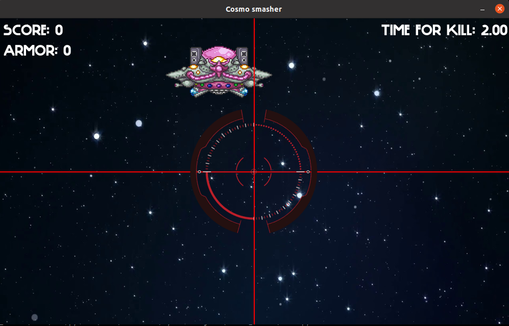

# Перед запуском
Убедитесь, что у Вас установлен ***pygame***
```bash
pip show pygame
```
# Как запустить игру?
Для того чтобы запустить игру, необходимо, находясь в 
директории игры с main.py, прописать в консоли команду:  
```bash
python3 main.py
```
# Геймплей
Вы находитесь в космическом корабле и непосредственно
управляете орудием. На Вашем пути то и дело появляются
**инопланетные захватчики**. Используйте свое орудие, управляя
прицелом с помощью **клавиш-стрелок**. Стреляйте по врагам,
нажимая клавишу **SPACE**. За попадание по врагу и уничтожение
его Вы получаете **очки материалов (SCORE)**. Старайтесь попадать метко, 
чтобы получить больше **SCORE**. Если получилось так, что Вы 
промахнулись, то Вы потеряете один материал(**-1 SCORE**). И да, враги на Вашем пути 
не так глупы, как Вам могло показаться. Они не будут ждать, 
пока Вы прицеливаетесь. Всего несколько секунд и Вы сами окажетесь лишь
грудой материалов. После убийств 10 врагов, Вы
накапливаете достаточно **материала** для усиления **брони (+1 ARMOR**).
1 **ARMOR** спасает от 1 выстрела врага. 
На Вашем пути также могут оказаться беззащитные мишки ***(Вы же их не тронете?)***
Накопив необходимое количество материалов, Вы сможете совершить 
***межпространственный гиперскачок*** и попасть домой, обойдя всех врагов. 
Лишившись материалов или попав под выстрел без **брони**, игра будет 
окончена Вашим ***поражением***.
# Интерфейс
 - ***Слева сверху*** находятся **SCORE (очки материалов)** и **ARMOR (очки брони)**
 - ***Посередине сверху*** периодически появляется сообщение говорящее о **метком 
   выстреле** по врагу. (В том случае, если выстрел будет метким...)
 - ***Справа сверху*** показывается **оставшееся до атаки врага время**. 

